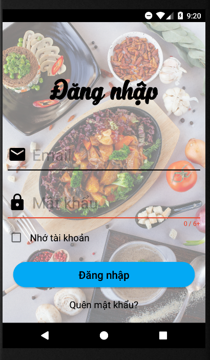
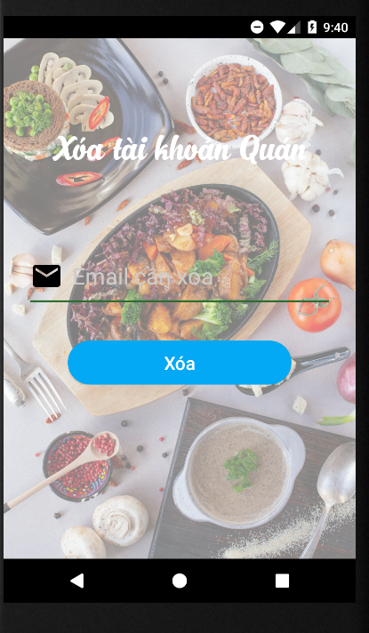
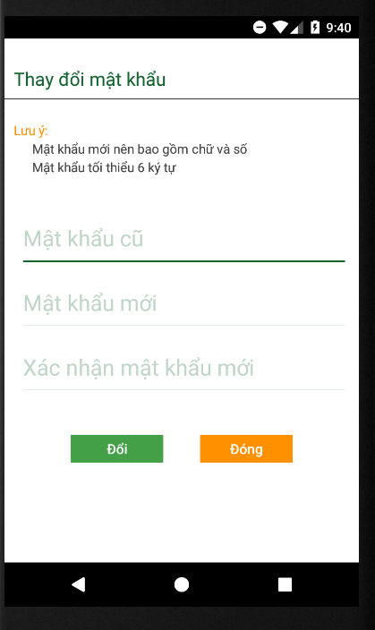
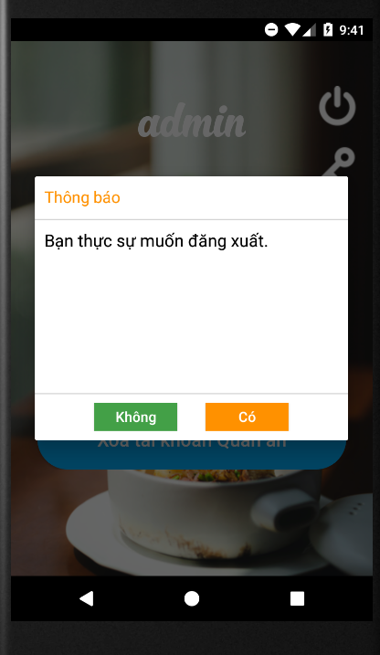

# Ứng dụng  - Order Food

Ứng dụng được dùng để đặt đồ ăn online cho nhưng người có nhu cầu mua đồ ăn tương tự như Grap food,baemin và còn cho phép các quán ăn có thể 
quản lí,cập nhật,nhận đơn hàng từ khách hàng.
## Nội dung
1. [Chức năng](#chức-năng)

   1. [Đăng nhập / Đăng kí](#đăng-nhập-/-đăng-kí)

   1. [Tài khoản admin](#Tài-khoản-admin)
   
   1. [Tài khoản quán ăn](#Tài-khoản-quán-ăn)

   1. [Tài khoản khách hàng](#Tài-khoản-khách-hàng)
   
   
1. [Yêu cầu thiết bị](#yêu-cầu-thiết-bị)

1. [Thư viện và công nghệ](#thư-viện-và-công-nghệ)

1. [Tác giả](#tác-giả)

## Chức năng
### Đăng nhập / Đăng kí
   * Giao diện
   
   * Đăng nhập
  
   * Đăng kí
   
   

     
   

    

### Tài khoản admin
   * Xem danh sách tài khoản

   * Thêm tài khoảng quán ăn
  
   * Xóa tài khoản quán ăn
   
   * Thay đổi mật khẩu
   
   * Đăng xuất
   
   

        
   

    
### Tài khoản quán ăn
   * Giao diện
   
   * Danh sách món ăn
  
   * Thêm món ăn
   
   * Các đơn đặt hàng
   
   * Cập nhật thông tin
   
   * Đổi mật khẩu
     
   

        
   

### Tài khoản khách hàng
   * Giao diện
   
   * Xem thông tin cá nhân
   
   * tìm kiếm món ăn
   
   * xem giỏ hàng
   
   * món ăn yêu thích
   
   

         
   

## Yêu cầu thiết bị
-Android:

   +Android studio : 4.1.1

   +Gradle : 4.1

   +Min sdk : 21

   +Target sdk : 28

## Thư viện và công nghệ

- Language : Java

- Database: Sử dụng Firebase của google

## Tác giả
Nguyễn Nhật Tuấn-18521603

