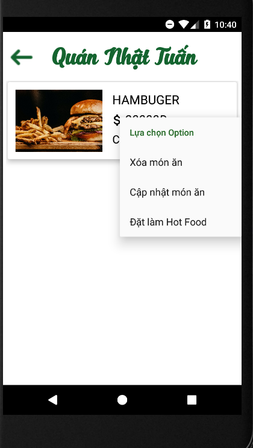

# Ứng dụng  - Order Food

Ứng dụng được dùng để đặt đồ ăn online cho nhưng người có nhu cầu mua đồ ăn tương tự như Grap food,baemin và còn cho phép các quán ăn có thể 
quản lí,cập nhật,nhận đơn hàng từ khách hàng.
## Nội dung
1. [Chức năng](#chức-năng)

   1. [Đăng nhập / Đăng kí](#đăng-nhập-/-đăng-kí)

   1. [Xem show diễn hot](#xem-show-diễn-hot)
   
   1. [Xem show ca sĩ yêu thích](#xem-show-ca-sĩ-yêu-thích)

   1. [Tìm kiếm show diễn](#tìm-kiếm-show-diễn)
   
   1. [Xem lịch diễn các show trong tháng](#xem-lịch-diễn-các-show-trong-tháng)

   1. [Lưu show diễn, ca sĩ yêu thích](#xem-show-diễn,-ca-sĩ-yêu-thích)

   1. [Xem thông tin tài khoản](#xem-thông-tin-tài-khoản)
   
1. [Yêu cầu thiết bị](#yêu-cầu-thiết-bị)

1. [Thư viện và công nghệ](#thư-viện-và-công-nghệ)

1. [Tác giả](#tác-giả)

1. [Giấy phép](#giấy-phép)

## Chức năng
### Đăng nhập / Đăng kí
   * Đăng nhập
  
   * Đăng kí
   
   

    
   

    

### Tài khoảng admin
   * Xem danh sách tài khoản

   * Thêm tài khoảng quán ăn
  
   * Xóa tài khoản quán ăn
   
   * Thay đổi mật khẩu
   
   * Đăng xuất
   
   

        
   

    
### Tài khoản quán ăn
   * Danh sách món ăn
  
   * Thêm món ăn
   
   * Các đơn đặt hàng
   
   * Cập nhật thông tin
   
   * Đổi mật khẩu
     
   

        
   

### Tìm kiếm show diễn
   * Tìm theo tên
  
   * Tìm trên map
   
   

    
   

### Xem lịch diễn các show trong tháng
   
   

   
   

### Lưu show diễn, ca sĩ yêu thích
   * Xem show quan tâm
  
   * Xem ca sĩ yêu thích
   
   

     
   

### Xem thông tin tài khoản
   * Xem chính sách, liên lạc
  
   * Đổi thông tin tài khoản
   
   

    
   

   
## Yêu cầu thiết bị
-Android:

   +Android studio : 3.0.1

   +Gradle : 4.1

   +Min sdk : 19

   +Target sdk : 26

-iOS:

   +iOS: 8.0

## Thư viện và công nghệ

- Language : Javascript

- FrameWork : React Native 0.55.4

- Database: phpMyAdmin

* react-native - https://github.com/facebook/react-native

* react-navigation - https://github.com/react-navigation/react-navigation

* react-native-maps - https://github.com/react-native-community/react-native-maps

* react-native-swiper - https://github.com/leecade/react-native-swiper

* react-native-linear-gradient - https://github.com/react-native-community/react-native-linear-gradient

* react-native-view-more-text - https://github.com/nlt2390/react-native-view-more-text

## Tác giả
Lê Trọng Tín - 15520893@gm.uit.edu.vn

Huỳnh Việt Tiến - 15520877@gm.uit.edu.vn

Hồ Hoàng Phi Long - 15520439@gm.uit.edu.vn

## Giấy phép

    Copyright 2014

    Licensed under the Apache License, Version 2.0 (the "License");
    you may not use this file except in compliance with the License.
    You may obtain a copy of the License at

       http://www.apache.org/licenses/LICENSE-2.0

    Unless required by applicable law or agreed to in writing, software
    distributed under the License is distributed on an "AS IS" BASIS,
    WITHOUT WARRANTIES OR CONDITIONS OF ANY KIND, either express or implied.
    See the License for the specific language governing permissions and
    limitations under the License.
